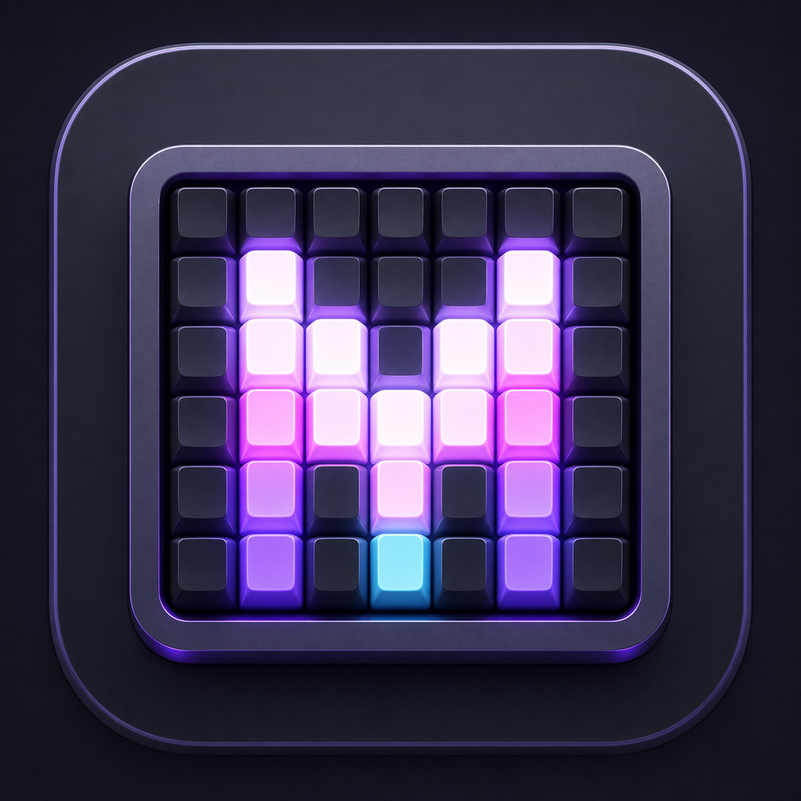
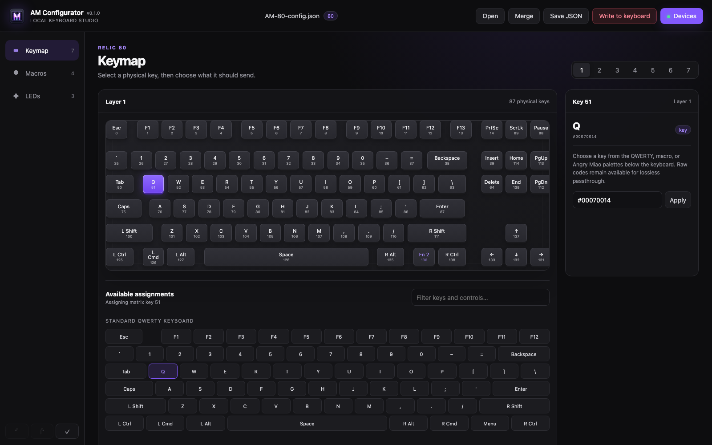
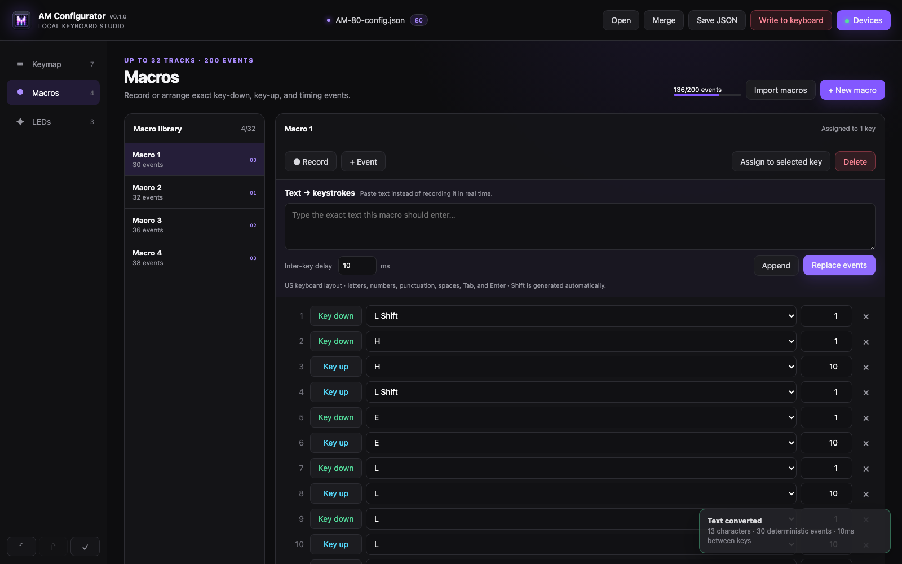
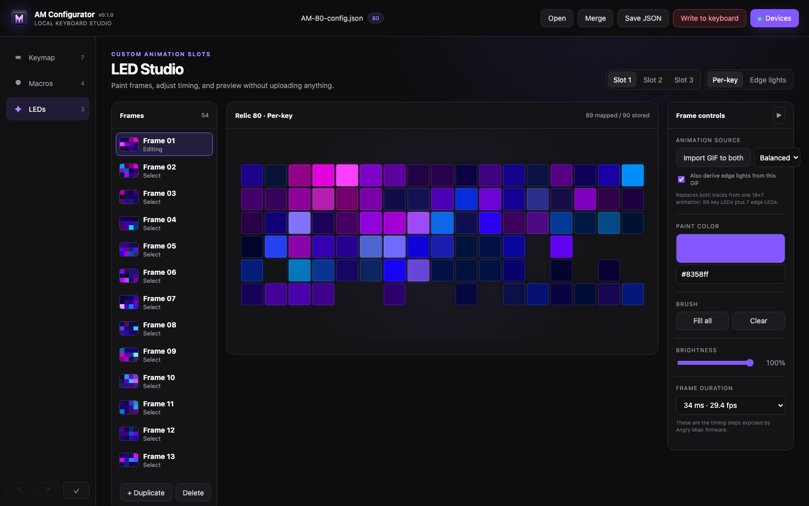

<p align="center">
  
</p>

<h1 align="center">AM Configurator</h1>

<p align="center">
  A standalone, local keyboard studio for Angry Miao hardware.<br>
  Edit keymaps, build macros, and animate LEDs without AM Master or the vendor web app.
</p>

<p align="center">
  <a href="https://github.com/roethlar/AMKB-GUI/actions/workflows/ci.yml"></a>
  <a href="https://github.com/roethlar/AMKB-GUI/actions/workflows/desktop.yml"></a>
  <a href="LICENSE"></a>
</p>

AM Configurator works with Angry Miao's JSON profile format and communicates
directly with supported keyboards over USB serial. Configuration stays on your
computer: there is no account, cloud service, or dependency on the reference
CLI repository.

## Download

| Platform | Package | What the build verifies |
|---|---|---|
| macOS | Versioned `.dmg` | Mounts the image and launches the bundled app smoke test |
| Windows x64 | Per-user `Setup.exe` | Installs silently, launches the installed app, then uninstalls |
| Linux x86-64 | `.AppImage` | Executes the finished AppImage in extract-and-run mode |

Packaged releases belong on the [GitHub Releases page](https://github.com/roethlar/AMKB-GUI/releases).
Before the first tagged release is published, download the current installers
from the latest successful [Desktop installers workflow](https://github.com/roethlar/AMKB-GUI/actions/workflows/desktop.yml?query=branch%3Amain+is%3Asuccess).
Every installer workflow run receives an increasing build version based on its
GitHub run number. For example, run 11 is version `0.1.11`. That version appears
in the app, the installer filename, and the downloadable artifact name, and is
shared by the macOS, Windows, and Linux builds from that run.

The installers are not code-signed yet. macOS Gatekeeper and Windows
SmartScreen may warn on first launch; review the downloaded file and repository
before approving it.

## Keyboard-shaped keymaps

Choose a physical key on the board, then assign from a familiar QWERTY palette,
macros, or Angry Miao-specific controls. All seven firmware layers remain
visible and the Relic, CyberBoard, and Alice layouts retain their physical
shape.



## Macros without recorded pauses

Record exact key-down/key-up events when you need them, import compatible
macros from another profile, or paste text and let the app generate deterministic
keystrokes with a fixed inter-key delay. The editor displays the firmware budget
of 32 macro tracks and 200 events across the complete profile.



## LED animation for the actual hardware

Paint frames, preview animation, import GIFs, and choose only timing values the
firmware can represent. GIF pixels pass through the selected keyboard's own LED
map, including the CyberBoard's 40×5 display, AFA body lights, and the Relic 80's
separate per-key and seven-LED edge tracks.



Relic edge lights can follow a GIF or remain independent. **Static color**,
**Pulse color**, and **Hold painted frame** generate the edge track to match the
key animation's frame count, so a 200-frame GIF does not require 200 frames of
manual repainting. Variable GIF delays are resampled onto one of the 16 firmware
timing steps, and imported animations are capped at 256 frames.

## Supported keyboards

| Keyboard family | Firmware identity | LED editor |
|---|---|---|
| CyberBoard | `CB…` | Sparse physical layout plus 40×5 display |
| AM Relic 80 | USB `AM21`, JSON `80` | Physical per-key layout plus seven edge LEDs |
| AM AFA / AFA 2 | `ALICE` | Physical Alice layout and body lights |

Firmware revisions can differ. Keep an official JSON backup before the first
write to a board or firmware version you have not previously tested.

## Safe device workflow

1. Connect one keyboard by USB and open **Devices**.
2. Select the board and choose **Read keymap & macros**, or open a complete JSON
   profile when its LED data must be preserved.
3. Edit keymaps, macros, and LED slots locally.
4. Save a portable JSON backup.
5. Choose the always-visible **Write to keyboard** button and type the displayed
   device ID to confirm the full write.

Selecting a device never writes to it. A confirmed write replaces the complete
device configuration—LEDs, keymaps, and macros—and performs keymap/macro
read-back before recording a verified local snapshot.

### Why LED state needs a JSON backup

The firmware protocol exposes keymap and macro reads but does not expose stored
LED frames. After a verified write, AM Configurator retains the complete profile
on that computer so later keymap or macro edits can preserve the known LEDs.
That record does not travel with the keyboard. Use **Save JSON** and open the
portable profile when moving to another machine.

## Run from source

Python 3.11 or newer and [uv](https://docs.astral.sh/uv/) are required:

```sh
uv sync --extra desktop
uv run --extra desktop am-configurator
```

You can open and merge official exports at launch. Relic key and LED exports are
often separate:

```sh
uv run --extra desktop am-configurator AM-80Relic.json AM-80Relic-KEY.json
```

The interface runs in a native window backed by a token-authenticated loopback
server.

<details>
<summary><strong>Build native installers</strong></summary>

PyInstaller must run on the target operating system; it is not a
cross-compiler. From the repository root, build and smoke-test the installer
for the current operating system with:

```sh
python build.py
```

The script automatically advances a local build number, temporarily stamps it
into the application, restores the tracked base version afterward, and writes
the finished artifact to `dist/`. Existing artifacts are considered when the
next number is selected—for example, the build after `0.1.11` is `0.1.12`.

Use a specific build number or skip dependency synchronization when needed:

```sh
python build.py --build-number 42
python build.py --skip-sync
```

It produces a versioned DMG on macOS, an Inno Setup installer on Windows, or an
AppImage on Linux. Each operating system must run the script separately.

</details>

<details>
<summary><strong>Development verification</strong></summary>

```sh
uv run --frozen python -m unittest discover -s tests -v
uv run --frozen python -m compileall -q am_configurator packaging build_tools
node --test tests/web/*.test.js
node --check am_configurator/web/lighting_state.js
node --check am_configurator/web/app.js
uv build
```

</details>

## Project status

AM Configurator is independent community software and is not affiliated with or
endorsed by Angry Miao. The protocol implementation was derived from the
MIT-licensed [`GeneralD/cyberboard-cli`](https://github.com/GeneralD/cyberboard-cli)
project; see [`THIRD_PARTY_NOTICES`](THIRD_PARTY_NOTICES).
