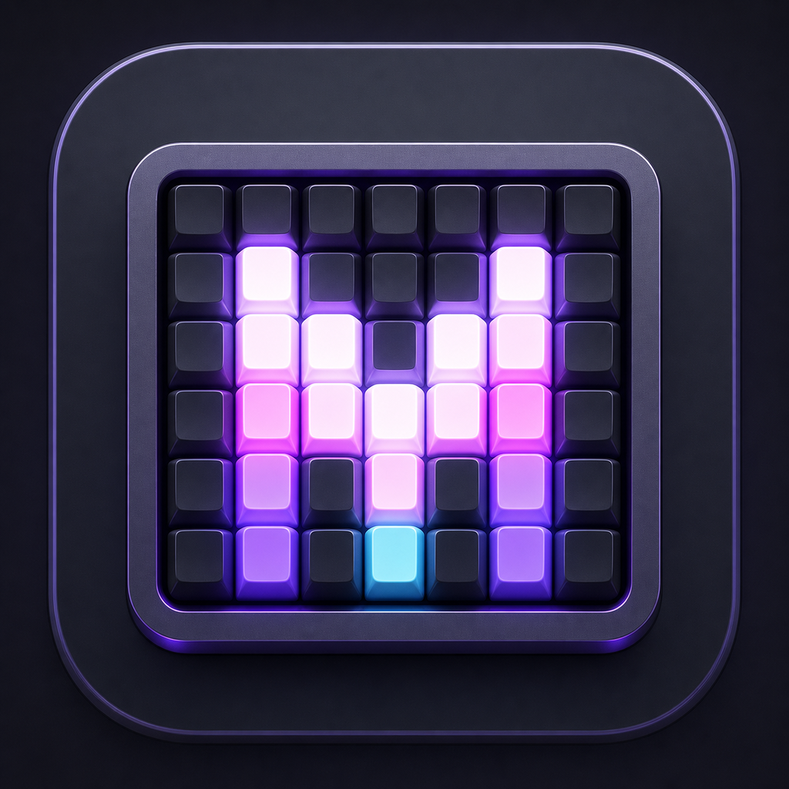
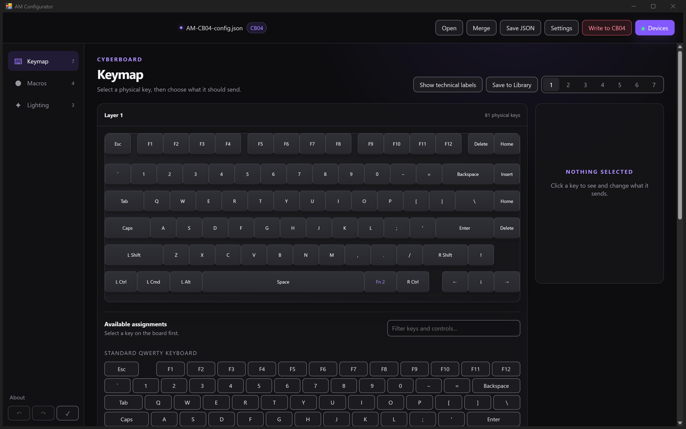
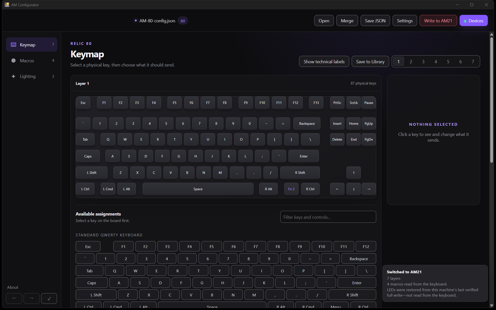
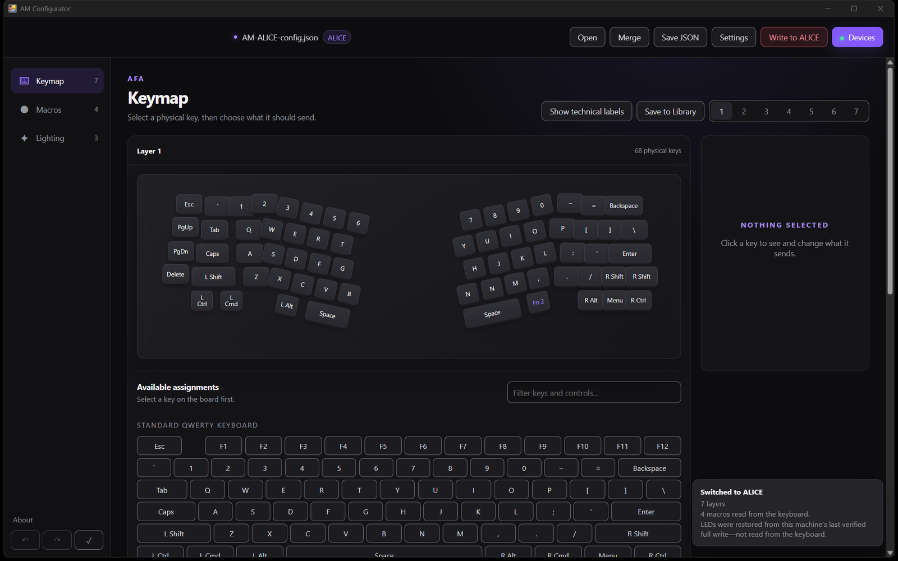
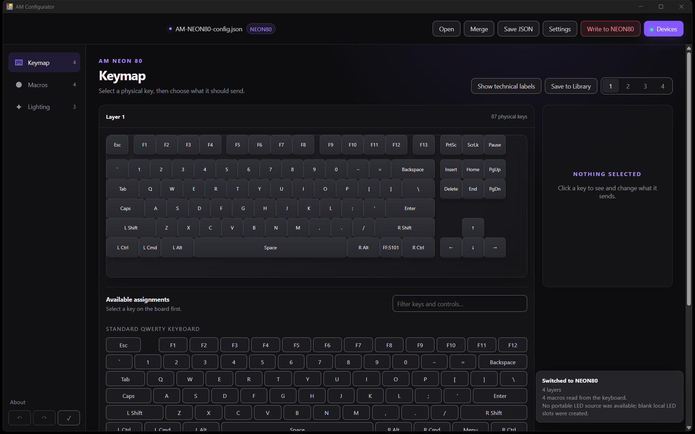
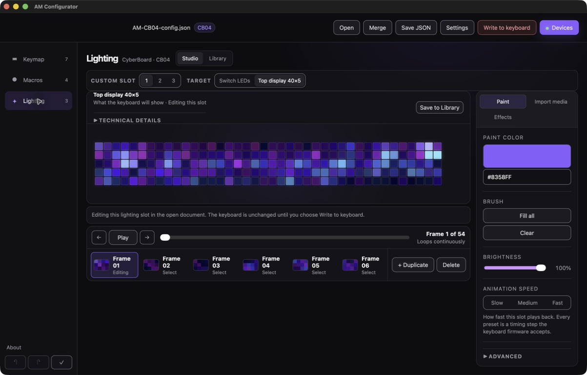
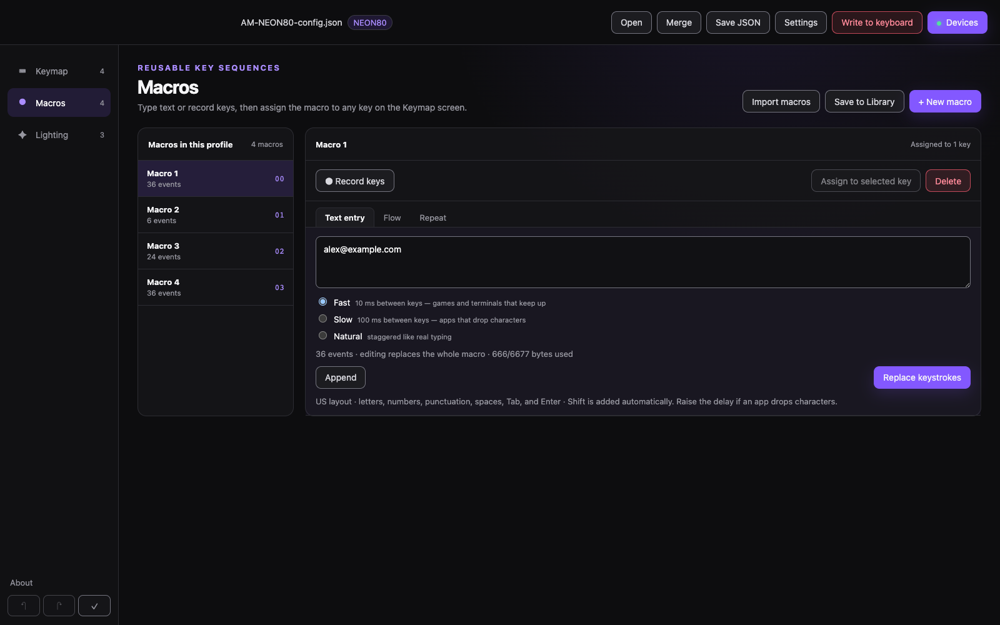

<p align="center">
  
</p>

<h1 align="center">AM Configurator</h1>

<p align="center">
  Set up your Angry Miao keyboard — keymaps, macros, and lighting — from one app on your own computer.
</p>

<p align="center">
  <a href="https://github.com/roethlar/AMKB-GUI/actions/workflows/ci.yml"></a>
  <a href="https://github.com/roethlar/AMKB-GUI/actions/workflows/desktop.yml"></a>
  <a href="LICENSE"></a>
</p>

## Download the latest release

Get the installer for your computer from the
[latest release](https://github.com/roethlar/AMKB-GUI/releases/latest):

| Your computer | File to download |
|---|---|
| macOS, Apple silicon | `AM-Configurator-<version>-macOS-arm64.dmg` |
| Windows 11 x64 | `AM-Configurator-<version>-Windows-x64-Setup.exe` |
| Linux x86-64 | `AM-Configurator-<version>-Linux-x86_64.AppImage` |

The [GitHub Releases page](https://github.com/roethlar/AMKB-GUI/releases) is the
only public installer source. Workflow artifacts are temporary candidates for
maintainers, not downloads.

The packages are not code-signed, so macOS or Windows may ask you to approve the
app the first time you open it. Follow the narrow per-application steps in
[Installing AM Configurator](docs/installing.md); never turn off an operating
system's security checks globally.

Release notes are published with each GitHub Release.

## Supported keyboards and operating systems

| Keyboard | Identifier | Layers and macros | Lighting |
|---|---|---|---|
| CyberBoard | `CB…` | Up to 7 layers and 32 macros | Switch LEDs plus the 40×5 top display |
| AM Relic 80 | USB `AM21`, profile `80` | Up to 7 layers and 32 macros | Per-key lights plus seven edge lights |
| AM AFA / AFA 2 | `ALICE` | Up to 7 layers and 32 macros | Alice key lights and centre body lights |
| AM Neon 80 | `NEON80` | 87-key physical layout, four keymap layers, and 16 macros | 89 axial LEDs, a 46×5 head matrix, and side lights derived from it |

Each board draws on its own physical layout in the Keymap screen:

<table>
<tr>
<td align="center" width="50%"><strong>CyberBoard</strong><br></td>
<td align="center" width="50%"><strong>AM Relic 80</strong><br></td>
</tr>
<tr>
<td align="center" width="50%"><strong>AM AFA</strong><br></td>
<td align="center" width="50%"><strong>AM Neon 80</strong><br></td>
</tr>
</table>

The app runs on macOS (Apple silicon), Windows 11 x64, and Linux x86-64. On
Linux the AM Neon 80 also needs a one-time permission rule — see
[AM Neon 80 on Linux](docs/neon-80-linux.md).

Firmware revisions differ between boards. Keep a complete portable JSON profile,
or the original media needed to rebuild it, before your first write to a board
or a firmware version you have not used before.

## Five-minute quick start

1. **Install** the file for your computer and open **AM Configurator**.
2. **Plug in one keyboard** over USB. Close AM Master, Vial, VIA, QMK Toolbox,
   and anything else that might be holding the board.
3. Choose **Connect a keyboard**, pick your board under **Devices**, then choose
   **Read keymap & macros**. Reading never writes to the keyboard. Already have a
   profile saved? Choose **Open a JSON profile** instead.
4. **Make a change.** On **Keymap**, select a physical key and give it a new
   assignment. On **Lighting**, paint a frame and watch it in the Studio.
5. **Save JSON** to keep a portable backup of everything you just did.
6. Choose **Write to keyboard** — it names your board once one is connected, for
   example **Write to NEON80**. Type the device ID the dialog shows you, then
   choose **Write full configuration**. An AM Neon 80 also needs its physical
   Esc+F2 unlock.

## What it looks like


*Keymap — select a physical key, then choose what it should send.*



*Lighting — edit a slot directly, or preview a media or effect result before applying it to the open profile.*



*Macros — type the text you want, or record the keys you press.*

## What you can do

### Keymap

Select a physical key on a keyboard-shaped layout, then assign a normal QWERTY
key, one of your macros, or an Angry Miao control such as under-key and top
display lighting. Every layer in the profile stays available, and each supported
model keeps its real shape rather than a grid of matrix numbers. If you need the
firmware-level value, **Advanced keycode** and **Show technical labels** are one
click away and round-trip whatever the keyboard reported.

### Macros

**Text entry** turns typed text into the exact keystrokes the keyboard replays,
with one timing choice: Fast, Slow, or Natural — a WPM target or your own
captured cadence. **Flow** edits the macro event by event — key, down/up, and
pause in place — and combos such as Ctrl+Alt+Del are built or recorded as
ordinary rows. **Repeat** appends a repeated key press and quotes the capacity
cost before anything changes. **Record keys** captures a sequence as you press
it. The editor shows the selected keyboard's own macro capacity instead of
assuming one budget for every model.

### Lighting

The Lighting Studio has three manual tools. **Paint** colours individual lights
directly on the physical LED output, with one shared horizontal timeline.
**Import media** brings in GIF, PNG, BMP, and JPEG files and keeps the source frame and
what the keyboard will show together while you pan, zoom, or stretch. **Effects**
shows Pulse, Hue cycle, Sweep, Shimmer, and Move & zoom as a live draft. Imported
media and effects change the open profile only when you choose **Apply**; **Save
to Library** remains separate. Timing choices are limited to values the destination
firmware can actually play.

### Library

**Save to Library** keeps a reusable copy of a keymap, a macro set, imported
media, or a lighting slot. Applying something changes only the document you have
open; saving to Library is always its own labelled action, so nothing is stored
behind your back. Removal is reversible. When you open a profile, keymap, macro,
and lighting compatibility are shown separately, so you can take only the parts
the destination keyboard can safely accept — and if a Relic export arrived as a
separate key file and LED file, **Merge** brings the second one in.

### Optional AI

AI is off by default. While it is off, the AI controls and setup fields are
hidden, there is no automatic Ollama discovery, and every manual Lighting and
Library tool still works. Turn it on in **Settings** and choose one of two
backends: **Ollama**, which talks to an Ollama server you already run on this
computer or on your network, or **Direct API**, which sends your request to an AI
service you configure (xAI, Anthropic, OpenAI, Gemini, Kimi/Moonshot, or
DeepSeek). AM Configurator never downloads or installs a model for you.

A **Direct API** request can cost money under your own provider account. Only
your prompt and the selected keyboard's size are sent — imported media, keymaps,
macros, device identifiers, and Library files stay on your computer. Anything
generated lands in the same Library as your manual and imported work.

## Before you write to a keyboard

Selecting a keyboard, or reading one, never changes it. Writing does.

- A confirmed full write replaces keymaps, macros, and LED data on the board, so
  the app asks you to type the device ID before it starts. Keep the USB cable
  connected until verification finishes. Firmware itself is never modified.
- After a write, the keymap and macros are read back and checked. Lighting is
  verified by eye on boards whose firmware cannot report its lights.
- Some keyboards cannot read their lighting back at all. Neon firmware does not
  expose LED read-back, so a device read is **not** a lighting backup. Use **Save
  JSON** and keep a complete profile — plus the original media if you imported
  any — before the first write, and take that file with you when you move to
  another computer.

## Verify your download

Every release publishes `SHA256SUMS.txt`, a `release-manifest.json`, and free
GitHub build attestations alongside the installers.
[Installing AM Configurator](docs/installing.md) walks through checking the
SHA-256 digest, running `gh attestation verify`, and approving the app on each
operating system.

## For developers

<details>
<summary><strong>Run from source, build installers, and verify</strong></summary>

Python 3.11 or newer and [uv](https://docs.astral.sh/uv/) are required:

```sh
uv sync --extra desktop
uv run --extra desktop am-configurator
```

Files named on the command line are opened, and merged, at launch. Relic key and
LED exports are often separate:

```sh
uv run --extra desktop am-configurator AM-80Relic.json AM-80Relic-KEY.json
```

The interface runs in a native window backed by a token-authenticated loopback
server.

PyInstaller must run on the target operating system; it is not a
cross-compiler. From the repository root, build and smoke-test the installer for
the current operating system with:

```sh
python build.py
```

Add `--skip-sync` when the environment is already prepared. The script builds
the canonical application version and writes the finished artifact to `dist/`: a
versioned DMG on macOS, an Inno Setup installer on Windows, or an AppImage on
Linux. Local and GitHub builds use the same product version; workflow run
numbers and commit IDs are diagnostic metadata only.

Windows installer packaging requires Inno Setup 6. It does not require Visual
Studio Build Tools, a C/C++ compiler, or a separate native media toolchain.

The automated verification entry point is:

```sh
uv run --frozen python -m unittest discover -s tests -v
uv run --frozen python -m compileall -q am_configurator packaging build_tools
node --test tests/web/*.test.js
node --check am_configurator/web/lighting_state.js
node --check am_configurator/web/lighting_workspace.js
node --check am_configurator/web/lighting_review.js
node --check am_configurator/web/lighting_targets.js
node --check am_configurator/web/lighting_composer.js
node --check am_configurator/web/library_state.js
node --check am_configurator/web/app.js
uv build
```

This matches the CI workflow. `uv sync --locked` installs no extras, so a change
touching optional-dependency code should also be checked in an environment built
without `--extra desktop`.

</details>

## Project status

AM Configurator is independent community software and is not affiliated with or
endorsed by Angry Miao. Its CyberBoard keymap and LED frame protocol handling was
derived from the MIT-licensed
[`GeneralD/cyberboard-cli`](https://github.com/GeneralD/cyberboard-cli) project;
GeneralD's copyright and license are preserved in
[`licenses/cyberboard-cli-LICENSE.txt`](licenses/cyberboard-cli-LICENSE.txt), and
all bundled third-party notices are listed in
[`THIRD_PARTY_NOTICES`](THIRD_PARTY_NOTICES).

If AM Configurator is useful to you, you can
[support it on Ko-fi](https://ko-fi.com/michaelcoelho).
