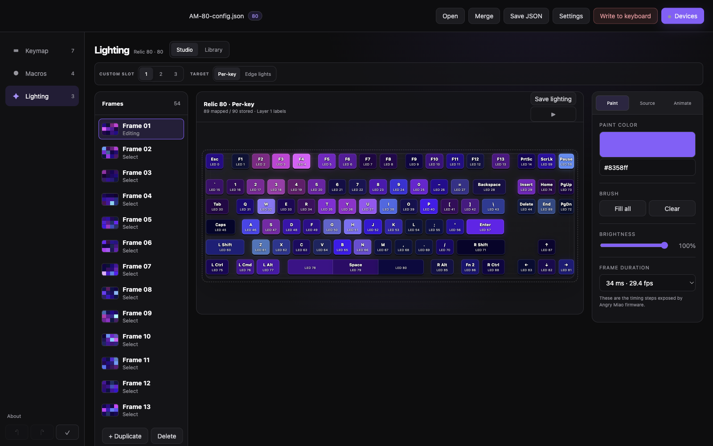

<p align="center">
  
</p>

<h1 align="center">AM Configurator</h1>

<p align="center">
  A standalone, local keyboard studio for Angry Miao hardware.<br>
  Edit keymaps, build macros, and animate LEDs without AM Master or the vendor web app.
</p>

<p align="center">
  <a href="https://github.com/roethlar/AMKB-GUI/actions/workflows/ci.yml"></a>
  <a href="https://github.com/roethlar/AMKB-GUI/actions/workflows/desktop.yml"></a>
  <a href="LICENSE"></a>
</p>

AM Configurator works with Angry Miao's JSON profile format and communicates
directly with supported keyboards over USB. Manual editing, imports, and the
Library work locally without an account or cloud service. Optional AI features
are separate, off by default, and described below.

## Download

| Platform | Package | What the build verifies |
|---|---|---|
| macOS | Versioned `.dmg` | Mounts the image and launches the bundled app smoke test |
| Windows x64 | Per-user `Setup.exe` | Installs silently, launches the installed app, then uninstalls |
| Linux x86-64 | `.AppImage` | Executes the finished AppImage in extract-and-run mode |

Packaged releases belong on the [GitHub Releases page](https://github.com/roethlar/AMKB-GUI/releases).
That page is the only public installer source; workflow artifacts are temporary
release candidates for maintainers. Each release also provides SHA-256
checksums and free GitHub build attestations.

The packages are not platform code-signed. The macOS app has an ad-hoc
integrity signature but no Apple notarization, and the Windows installer has no
Authenticode publisher signature. macOS or Windows may therefore request
approval on first launch. Follow the narrow per-application steps in
[Installing AM Configurator](docs/installing.md); do not disable operating-system
security globally.

## Keyboard-shaped keymaps

Choose a physical key on the board, then assign from a familiar QWERTY palette,
macros, or Angry Miao-specific controls. Every layer present in the profile
remains visible, and each supported model retains its physical shape. Neon,
Relic, CyberBoard, and Alice layouts use correctly sized keys rather than a raw
firmware matrix.


## Macros without recorded pauses

Record exact key-down/key-up events when you need them, import compatible
macros from another profile, or paste text and let the app generate deterministic
keystrokes with a fixed inter-key delay. The editor displays the selected
keyboard's own macro capacity instead of assuming one budget for every model.


## One Lighting Studio and Library

Paint individual LEDs per frame on a keyboard-shaped canvas, preview the
timeline, and choose only timing values the destination firmware can represent.
Multi-LED keys remain individually labelled and editable. The same Studio maps
the CyberBoard's 40×5 display, AFA body lights, Relic 80 per-key and edge
tracks, and the Neon 80 axial and top-display targets.



Import GIF, PNG, and BMP media, then pan, zoom, or stretch it inside the
destination overlay before applying it. GIF timing is resampled across the
complete source timeline under the keyboard's frame limit. Still images can be
animated locally with Pulse, Hue cycle, Sweep, Shimmer, and Move & zoom. None
of those tools requires AI.

Imported media, manual compositions, generated lighting, and keyboard profiles
can all be saved in the mixed Library. Removal is reversible, and profile
imports show keymap, macro, and lighting compatibility separately so a user can
apply only the sections the destination keyboard can safely accept.

### Optional AI

AI is off by default. While it is off, AI controls and setup fields are hidden,
there is no automatic Ollama discovery, and manual Lighting and Library tools
remain fully available. Enabling it allows either an already-installed local
Ollama model or a configured xAI, Anthropic, OpenAI, Gemini, Kimi/Moonshot, or
DeepSeek API adapter. The app never downloads a local model.

A remote provider can receive the entered prompt and structured recipe request,
and use may cost money under the user's provider account. Imported images,
keymaps, macros, device identifiers, and Library files are not sent as part of
that request. Generated results are saved to the same Library as manual and
imported work. Remote adapters remain experimental unless the release notes
explicitly record a live qualification.

## Supported keyboards

| Keyboard family | Firmware identity | Keymap and macro model | Lighting model |
|---|---|---|---|
| CyberBoard | `CB…` | Firmware-defined layers and macro budget | Sparse physical layout plus 40×5 display |
| AM Relic 80 | USB `AM21`, JSON `80` | Physical 80% layout with model-specific limits | Per-key layout plus seven edge LEDs |
| AM AFA / AFA 2 | `ALICE` | Physical Alice layout with model-specific limits | Alice key geometry and body lights |
| AM Neon 80 | `NEON80` | 87-key physical layout, four keymap layers, and 16 macros | 89 axial LEDs, 46×5 head matrix, and derived top-display channel |

Firmware revisions can differ. Keep a complete portable JSON with known LED
data, or the original media needed to reconstruct it, before the first write to
a board or firmware version you have not previously tested.

## Safe device workflow

1. Close AM Master, Vial, VIA, QMK Toolbox, and any other application that may
   own the keyboard.
2. Connect one keyboard by USB and open **Devices**.
3. Select the board and choose **Read keymap & macros**, or open a complete JSON
   profile when its LED data must be preserved.
4. Edit keymaps, macros, and Lighting slots locally.
5. Save a portable JSON backup.
6. Choose the always-visible **Write to keyboard** button and type the displayed
   device ID to confirm the full write. Neon 80 also requires its physical
   Esc+F2 unlock.

Selecting or reading a device never writes to it. A confirmed full write
replaces keymaps, macros, and LED data, then performs keymap/macro read-back
before recording a verified local snapshot. Lighting verification remains
visual where firmware cannot read stored LED frames.

### Why Neon LED state needs a source backup

Neon firmware does not expose LED read-back. A device read is therefore not a
lighting backup: its LED placeholders are synthetic and do not describe the
current pattern. After a verified write, AM Configurator retains the submitted
complete profile on that computer so later edits can preserve those known LEDs,
but that record does not travel with the keyboard. Use **Save JSON**, keep the
original media/configuration, and open the portable profile when moving to
another machine. Linux users also need the
[Neon 80 udev instructions](docs/neon-80-linux.md).

## Run from source

Python 3.11 or newer and [uv](https://docs.astral.sh/uv/) are required:

```sh
uv sync --extra desktop
uv run --extra desktop am-configurator
```

You can open and merge official exports at launch. Relic key and LED exports are
often separate:

```sh
uv run --extra desktop am-configurator AM-80Relic.json AM-80Relic-KEY.json
```

The interface runs in a native window backed by a token-authenticated loopback
server.

<details>
<summary><strong>Build native installers</strong></summary>

PyInstaller must run on the target operating system; it is not a
cross-compiler. From the repository root, build and smoke-test the installer
for the current operating system with:

```sh
python build.py
```

The script builds the canonical application version and writes the finished
artifact to `dist/`. Local and GitHub builds use the same product version;
workflow run numbers and commit IDs remain diagnostic metadata.

Skip dependency synchronization when the environment is already prepared:

```sh
python build.py --skip-sync
```

It produces a versioned DMG on macOS, an Inno Setup installer on Windows, or an
AppImage on Linux. Each operating system must run the script separately.

</details>

<details>
<summary><strong>Development verification</strong></summary>

```sh
uv run --frozen python -m unittest discover -s tests -v
uv run --frozen python -m compileall -q am_configurator packaging build_tools
node --test tests/web/*.test.js
node --check am_configurator/web/lighting_state.js
node --check am_configurator/web/lighting_review.js
node --check am_configurator/web/lighting_targets.js
node --check am_configurator/web/lighting_composer.js
node --check am_configurator/web/library_state.js
node --check am_configurator/web/app.js
uv build
```

This matches the CI workflow. Note that `uv sync --locked` installs no extras,
so a change touching optional-dependency code should also be checked in an
environment built without `--extra desktop`.

</details>

## Project status

AM Configurator is independent community software and is not affiliated with or
endorsed by Angry Miao. The protocol implementation was derived from the
MIT-licensed [`GeneralD/cyberboard-cli`](https://github.com/GeneralD/cyberboard-cli)
project; see [`THIRD_PARTY_NOTICES`](THIRD_PARTY_NOTICES).
