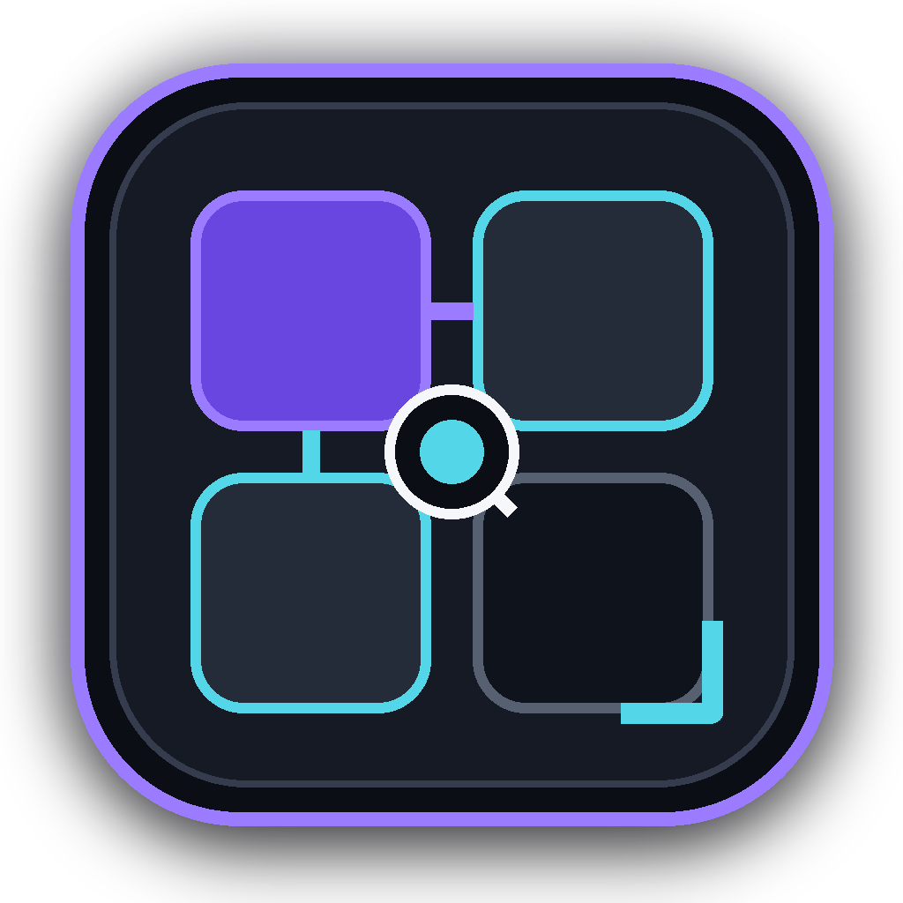

<p align="center">
  
</p>

<h1 align="center">OpenKeeb</h1>

<p align="center">
  A local, open workbench for compatible Angry Miao, Vial, and VIA keyboards.
</p>

<p align="center">
  <a href="https://github.com/roethlar/AMKB-GUI/actions/workflows/ci.yml"></a>
  <a href="https://github.com/roethlar/AMKB-GUI/actions/workflows/desktop.yml"></a>
  <a href="LICENSE"></a>
</p>

> [!IMPORTANT]
> OpenKeeb is the next major version and is under development on the
> `v2/openkeeb` branch. The latest published installers are still
> **AM Configurator 0.1.68**. No OpenKeeb release has been published.

## Download the latest published release

Download AM Configurator 0.1.68 from the
[latest GitHub Release](https://github.com/roethlar/AMKB-GUI/releases/latest):

| Computer | Published file |
|---|---|
| macOS, Apple silicon | `AM-Configurator-<version>-macOS-arm64.dmg` |
| Windows 11 x64 | `AM-Configurator-<version>-Windows-x64-Setup.exe` |
| Linux x86-64 | `AM-Configurator-<version>-Linux-x86_64.AppImage` |

The [GitHub Releases page](https://github.com/roethlar/AMKB-GUI/releases) is
the only public installer source. Workflow artifacts are temporary development
candidates, not releases. Current OpenKeeb source builds use these names:

- `OpenKeeb-<version>-macOS-arm64.dmg`
- `OpenKeeb-<version>-Windows-x64-Setup.exe`
- `OpenKeeb-<version>-Linux-x86_64.AppImage`

[Installing the published release](docs/installing.md) covers hashes,
signatures, and per-system installation. Never disable an operating system's
security checks globally.

Release notes are published with each GitHub Release.

## Keyboard support

OpenKeeb supports explicit firmware ecosystems, not every USB keyboard.

| Ecosystem | Discovery and profiles | Keymaps and macros | Lighting |
|---|---|---|---|
| Angry Miao | CyberBoard, AM Relic 80, AM AFA/AFA 2, AM Neon 80 | Full current read, edit, and confirmed write workflow | Model-specific Studio tools for supported LEDs and displays |
| Vial | Reads firmware identity and embedded layout from compatible Vial devices | Read, edit, transfer, physical-unlock guidance, confirmed write, exact read-back | Generic Vial lighting is not enabled yet |
| VIA | Uses a matching VIA definition supplied by the user | Definition-bound read, edit, transfer, confirmed write, exact read-back | Automatic definition fetching and generic VIA lighting are not enabled yet |

OpenKeeb does not flash firmware. It does not claim universal QMK, Vial, or VIA
support. A keyboard must expose the protocol and information the selected
workflow needs.

Angry Miao lighting and physical layouts currently include:

| Keyboard | Identifier | Keymap and macro limits | Lighting |
|---|---|---|---|
| CyberBoard | `CB…` | Up to 7 layers and 32 macros | Switch LEDs and 40×5 top display |
| AM Relic 80 | USB `AM21`, profile `80` | Up to 7 layers and 32 macros | Per-key lights and seven edge lights |
| AM AFA / AFA 2 | `ALICE` | Up to 7 layers and 32 macros | Alice key lights and centre body lights |
| AM Neon 80 | `NEON80` | 87-key physical layout, four keymap layers, 16 macros | 89 axial LEDs, 46×5 head matrix, derived side lights |

AM Neon 80 on Linux needs a one-time host permission rule:
[AM Neon 80 on Linux](docs/neon-80-linux.md).

## Five-minute quick start

1. Open **OpenKeeb** from a source or development build.
2. Choose **Connect a keyboard** for hardware, or **Open a profile** for
   document-only work.
3. Under **Keyboards**, select the exact interface. VIA asks for a matching
   definition before **Read keymap & macros**.
4. Edit the **Keymap**. Angry Miao profiles also expose **Macros** and
   model-specific **Lighting Studio** tools.
5. Choose **Save profile** before any hardware action.
6. Choose **Write to keyboard** only when the exact connected target is shown.
   Review the preflight, save the backup, type the required confirmation, and
   choose **Write full configuration** for an Angry Miao profile. Keep USB
   connected through read-back verification.

Reading, selecting, opening, editing, and saving a file do not write to a
keyboard.

## What it looks like

<table>
  <tr>
    <td align="center" width="50%"><strong>CyberBoard keymap</strong><br></td>
    <td align="center" width="50%"><strong>AM Relic 80 keymap</strong><br></td>
  </tr>
  <tr>
    <td align="center" width="50%"><strong>AM AFA keymap</strong><br></td>
    <td align="center" width="50%"><strong>AM Neon 80 keymap</strong><br></td>
  </tr>
</table>


*Keymap keeps the board central and the selected-key inspector subordinate.*


*Lighting Studio applies model-specific Angry Miao capabilities to the open
document; it does not imply generic Vial or VIA lighting support.*


*Macros exposes Text entry, Flow, Repeat, recording, and the connected model's
real capacity.*

## What you can do

### Keymap

Select a physical key and assign a portable QMK choice or a model-specific
control. Vial and VIA documents retain exact 16-bit codes that OpenKeeb does not
recognize. **Advanced keycode** and **Show technical labels** expose firmware
values without making them the normal path. Cross-keyboard transfer reports
what carried over, what adapted, and what still needs a placement decision.

### Macros

Angry Miao macro authoring offers **Text entry**, **Flow**, **Repeat**, and
**Record keys**. Capacity uses the selected model's actual encoding budget.
OpenKeeb preserves generic Vial/VIA macro data and can transfer it, but generic
macro authoring is not enabled yet.

### Lighting

The Angry Miao Lighting Studio provides **Paint**, **Import media**, and
**Effects**. Import GIF, PNG, BMP, and JPEG media, then pan, zoom, or stretch it for
the destination. Built-in effects include Pulse, Hue cycle, Sweep, Shimmer,
and Move & zoom. Source and board previews, the shared timeline, and **Apply**
all change the open document only. Generic Vial and VIA lighting is not
enabled. Some AM firmware cannot read lighting back, so a device read is not
always a lighting backup.

### Library

The OpenKeeb Library stores reusable profiles, keymaps, macro sets, imported
media, and lighting locally. **Save to Library** is always explicit. **Merge**
combines split Angry Miao exports when safe. **Settings** chooses the Library
folder. Removing an item is reversible before permanent deletion.

## Before you write to a keyboard

Selecting or reading a keyboard never changes it. Writing does.

- Document actions and keyboard actions are separate in the command bar.
- An Angry Miao full write replaces keymaps, macros, and LED data carried by
  the open profile.
- Vial and VIA writes require a freshly read live binding to the exact endpoint.
- VIA also requires the user-supplied definition used for the read.
- Angry Miao full writes show the exact product and affected content.
- The confirmation asks you to type the device ID shown before an Angry Miao
  write can begin.
- AM Neon 80 requires the physical Esc+F2 unlock.
- The app asks for an exact typed confirmation and creates a portable backup.
- Keymaps and macros are read back after writing. Accepted-byte failures switch
  to read/verify and never resend automatically.
- Firmware is never flashed.
- AM Neon 80 firmware does not expose LED read-back.
- Lighting that firmware cannot report must be verified visually. Keep the full
  profile and any imported source media.

## Verify your download

Published releases include `SHA256SUMS.txt` and
`release-manifest.json`. macOS and Windows downloads carry publisher
signatures; the Linux AppImage is unsigned. The published 0.1.68 release files
carry no GitHub build attestation.

[Installing the published release](docs/installing.md) explains SHA-256,
signature checks, and normal operating-system opening steps.

## Upgrading from releases with AI features

Releases through 0.1.68 offered optional AI providers. OpenKeeb does not read
those credentials. If you saved one, remove it from the operating-system
credential store under service `dev.amconfigurator.ai`:

- **macOS:** open Keychain Access, search for `dev.amconfigurator.ai`, and
  delete each provider entry.
- **Windows:** open Credential Manager → Windows Credentials and remove entries
  whose name contains `dev.amconfigurator.ai`.
- **Linux:** run `secret-tool clear service dev.amconfigurator.ai` for each
  saved entry, or remove it with your desktop's Passwords and Keys app.

The identifier is retained here because it is the historical credential-service
name users must search for.

## For developers

<details>
<summary><strong>Set up, run, test, and package</strong></summary>

OpenKeeb requires Python 3.11 or newer and
[`uv`](https://docs.astral.sh/uv/):

```sh
uv sync --extra desktop
uv run --extra desktop am-configurator
```

`am-configurator` is the retained compatibility command and PyPI
distribution name. Files named on the command line open or merge at launch.

Build and smoke-test the native installer for the current operating system:

```sh
python build.py
```

Use `--skip-sync` when the environment is already prepared. PyInstaller
must run on the target operating system.

The automated verification entry point is:

```sh
uv run --frozen python -m unittest discover -s tests -v
uv run --frozen python -m compileall -q am_configurator packaging build_tools
node --test tests/web/*.test.js
node --check am_configurator/web/lighting_state.js
node --check am_configurator/web/lighting_workspace.js
node --check am_configurator/web/lighting_review.js
node --check am_configurator/web/lighting_targets.js
node --check am_configurator/web/lighting_composer.js
node --check am_configurator/web/library_state.js
node --check am_configurator/web/hub_keymap_state.js
node --check am_configurator/web/hub_keycode_palette.js
node --check am_configurator/web/app.js
uv build
```

</details>

## Project status

OpenKeeb is an independent open-source community project. It is not affiliated
with or endorsed by Angry Miao, Vial, VIA, or their vendors or maintainers.

CyberBoard protocol handling was derived from the MIT-licensed
[`GeneralD/cyberboard-cli`](https://github.com/GeneralD/cyberboard-cli)
project. GeneralD's copyright and license are preserved in
[`licenses/cyberboard-cli-LICENSE.txt`](licenses/cyberboard-cli-LICENSE.txt);
all bundled third-party notices are listed in
[`THIRD_PARTY_NOTICES`](THIRD_PARTY_NOTICES).

If OpenKeeb is useful to you, you can support it on
[GitHub Sponsors](https://github.com/sponsors/roethlar) or
[Ko-fi](https://ko-fi.com/michaelcoelho).
